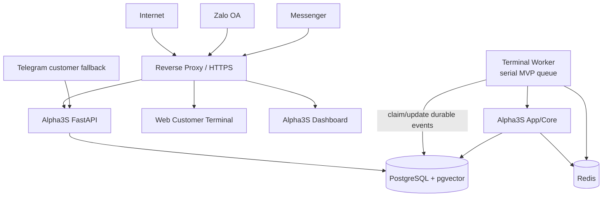
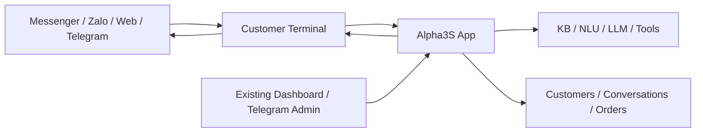
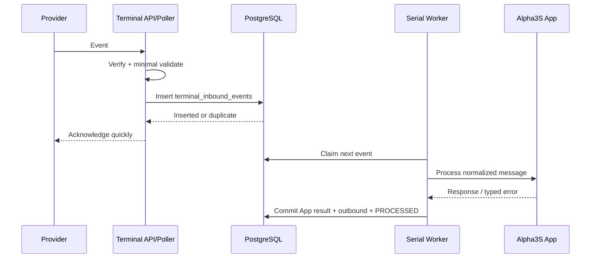

# Alpha3S Customer Terminal Architecture

## Document Control

Đây là bản kiến trúc MAJOR revision sau phản biện `AGW-REVIEW-001 v2.0.0` và Dev sign-off `AGW-REVIEW-002 v1.1.0`. PO đã khóa bản `AGW-ARCH-001 v2.0.0` làm canonical baseline ngày `2026-07-22`; v1.0.0 được lưu làm lịch sử.

## 1. Decision Summary

Alpha3S Gateway v2 được định nghĩa lại là **thin Customer Terminal**, không phải integration platform độc lập.

```text
Customer Channels
  → Customer Terminal
  → Alpha3S App/Core
  → Customer Terminal
  → Customer Channels
```

Customer Terminal chỉ sở hữu trách nhiệm vận chuyển message:

1. Verify và nhận event từ channel.
2. Normalize message vào một contract tối giản.
3. Dedupe, order và chuyển message tới Alpha3S App.
4. Deliver response, retry, dead-letter và trace.

Alpha3S App hiện tại tiếp tục là source of truth cho:

- customer;
- conversation và `bot_paused`;
- message history;
- Knowledge Base, NLU, prompt và LLM;
- product, price, stock, order và approval;
- business/handoff decision.

## 2. Approved Deployment Target — Where It Runs

Đây là architecture constraint đã được PO duyệt ngân sách:

| Item | Approved baseline |
|---|---|
| Host | Một VPS Linux |
| Compute | 2 vCPU |
| Memory | 4 GB RAM |
| Storage | 60 GB SSD |
| Runtime | Docker Compose |
| Initial role | Staging sớm; có thể promote thành production |
| Primary database | PostgreSQL + pgvector trên cùng VPS |
| Queue/cache | Redis trên cùng VPS |
| Public entry | Reverse proxy + HTTPS |
| Process recovery | `restart: always` + healthcheck |
| Backup | Automated PostgreSQL backup + off-host copy + restore drill |
| Backup target | Low-cost backup-only VPS/hosting; no Alpha3S runtime and no failover role |

### 2.1 What Runs on This VPS



Deploy units v2:

- reverse proxy;
- FastAPI API;
- one terminal/core worker initially;
- Telegram poller during transition;
- PostgreSQL + pgvector;
- Redis;
- production-built dashboard;
- optional lightweight web widget/API.

### 2.2 Explicit Hosting Non-Goal

**Không self-host Chatwoot trên VPS 2 vCPU / 4 GB.** Chatwoot chính thức yêu cầu tối thiểu 4 GB RAM cho riêng workload self-host, nên đặt cạnh Alpha3S trên cùng VPS sẽ vượt budget tài nguyên.

Nếu về sau PO chọn Chatwoot:

- ưu tiên Chatwoot Cloud; hoặc
- dùng VPS riêng có ngân sách riêng.

### 2.3 Resource Guardrails

- Tạo swap 2–4 GB để giảm nguy cơ OOM; swap không thay thế RAM.
- PostgreSQL khởi điểm `shared_buffers` khoảng 256 MB, giới hạn connection và dùng pool.
- Redis đặt `maxmemory`, TTL và eviction policy phù hợp dữ liệu cache; durable event không chỉ nằm trong Redis.
- Embedding model chỉ load trong một process. RSS phải được đo ngay tại Chặng A trước khi chốt KB V2; HOST-003 chỉ xác nhận lại trên VPS đích. Nếu vượt budget, chuyển sang model nhỏ/quantized hoặc hosted embedding API.
- Dashboard chạy production build, không dùng Next.js dev mode.
- Build/deploy không chạy đồng thời với workload nặng nếu gây memory spike.
- Disk alert tại 70/85/95%; backup không chỉ lưu trên cùng VPS.

## 3. Channel Priority

| Priority | Channel | Role in v2 |
|---|---|---|
| Existing | Messenger | Kênh đang chạy; migrate vào terminal trước |
| New #1 | Web chatbox | Website đã có; Alpha3S sở hữu toàn bộ widget, API, data flow và UX; dùng dashboard hiện tại làm staff inbox |
| New #2 | Zalo OA | Kênh bán hàng quan trọng ở Việt Nam nhưng cần OA, channel setup và phụ thuộc API/chính sách bên thứ ba |
| Fallback | Telegram | Customer fallback trong chuyển tiếp; Admin/Operations lâu dài |
| Optional | Chatwoot Cloud | Chỉ mở nếu cần inbox chuyên nghiệp hơn dashboard hiện tại |

Chatwoot không còn là trung tâm của roadmap v2. Web Customer Terminal được triển khai trước Zalo để kiểm chứng contract và reliable-delivery pipeline trên một channel do Alpha3S sở hữu hoàn toàn.

Telegram dùng cho khách hàng vẫn phải đi qua `terminal_inbound_events` và cùng durability contract. Telegram Admin/Operations có thể giữ operational path riêng, nhưng mọi lỗi gửi/nhận phải được log có cấu trúc và không được bị nuốt.

## 4. Scope and Non-Goals

### 4.1 Must Have

- Messenger/Zalo/Web dùng cùng terminal pipeline.
- Một normalized text message tối giản.
- Durable inbound acceptance tối thiểu.
- Durable outbound delivery tối thiểu.
- Dedupe, bounded retry và dead-letter.
- Idempotent order creation.
- Ordering an toàn cho cùng conversation.
- Trace ID xuyên suốt.
- Channel capability cho send window/quota/cost policy.
- VPS health, backup và restore evidence.

### 4.2 Deferred

- `tenant_id` và SaaS multi-brand.
- Identity graph/automatic cross-channel merge.
- Gateway-owned conversation model.
- Five-mode handoff state machine.
- Dynamic plugin marketplace.
- Standalone Gateway microservice.
- Full attachment/voice/video parity.
- Chatwoot self-host.

## 5. System Boundary



### 5.1 Terminal Owns

- provider verification;
- provider event/message ID;
- minimal channel-to-App mapping;
- terminal event/delivery status;
- retry/dead-letter;
- channel send capability;
- delivery trace.

### 5.2 App Owns

- customer and conversation record;
- `bot_paused` and handoff behavior;
- business message history;
- AI/business processing;
- order idempotency and mutations;
- staff actions and dashboard.

Terminal không tạo customer domain model thứ hai và không tự quyết định AI/human ownership.

## 6. Minimal Contract v2

Chỉ có một inbound contract chính trong v2:

```json
{
  "version": "2.0",
  "event_id": "provider-or-derived-id",
  "trace_id": "01J...",
  "channel": "messenger",
  "external_user_id": "123",
  "external_conversation_id": "123",
  "external_message_id": "mid.abc",
  "message_type": "text",
  "text": "Kiem tra don hang giup toi",
  "received_at": "2026-07-22T10:00:00Z",
  "channel_context": {
    "last_user_interaction_at": "2026-07-22T10:00:00Z"
  }
}
```

Rules:

- `channel + external_user_id` map vào identity key hiện hữu của App, ví dụ `tg:<id>`; không thêm identity graph v2.
- `external_message_id` là idempotency key inbound khi provider cung cấp.
- Với Web, widget phải sinh `client_message_id` UUID v4 ổn định cho từng message do người dùng tạo. Mọi resend/reconnect của cùng message phải dùng lại ID này; Terminal ánh xạ nó thành `external_event_id`. Không sinh ID mới khi retry.
- Contract chỉ hỗ trợ text trong MVP.
- Structured/attachment content chỉ thêm bằng MINOR version sau khi có channel use case thật.

Output tối giản:

```json
{
  "trace_id": "01J...",
  "channel": "messenger",
  "external_conversation_id": "123",
  "text": "Don hang dang duoc van chuyen.",
  "business_result_id": "optional-order-or-run-id"
}
```

## 7. Minimal Persistence

Không triển khai 8+ bảng platform trong v2. Chỉ thêm dữ liệu cần cho reliable terminal.

### 7.1 `terminal_inbound_events`

```text
id
channel
external_event_id
external_user_id
external_conversation_id
payload_json
status: RECEIVED | PROCESSING | PROCESSED | FAILED | DEAD_LETTER
attempt_count
next_attempt_at
trace_id
last_error
received_at
processed_at

UNIQUE(channel, external_event_id)
```

Với channel `web`, `external_event_id = client_message_id`; unique constraint trên là hàng rào chống nhân đôi bắt buộc.

### 7.2 `terminal_outbound_deliveries`

```text
id
channel
external_conversation_id
idempotency_key
payload_json
status: PENDING | SENDING | DELIVERED | RETRYING | DEAD_LETTER
attempt_count
next_attempt_at
provider_message_id
last_error_code
last_error
created_at
delivered_at

UNIQUE(channel, idempotency_key)
```

Không cần bảng tenant, channel account, delivery attempts riêng hoặc state-change audit trong v2. Attempt history có thể bắt đầu bằng structured log; nâng thành bảng khi vận hành cho thấy cần.

## 8. Processing and Ordering

### 8.1 Inbound Flow



### 8.2 Ordering Decision for v2

**Chốt:** Terminal MVP dùng **một serial consumer (`max_jobs=1`) cho inbound customer message queue**.

Lý do:

- traffic hiện thấp;
- bảo đảm ordering đơn giản, không cần distributed/keyed lock;
- tránh giữ database transaction trong lúc chờ LLM;
- crash recovery dựa trên durable event status;
- giảm code và rủi ro cho một dev.

Trade-off: một LLM call chậm có thể tăng queue wait cho mọi conversation. Đây là chấp nhận có chủ đích trong MVP.

Ngay trong Web pilot phải quan sát queue wait p95/backlog sau mỗi đợt test tải; không chờ tới sau khi public launch mới đánh giá trigger nâng cấp.

Trigger nâng cấp ordering:

- queue wait p95 vượt 5 giây trong giờ hoạt động; hoặc
- backlog liên tục trên 20 message; hoặc
- throughput thực tế cần nhiều hơn một Core run đồng thời.

Khi trigger xảy ra, tạo ADR để chuyển sang leased per-conversation processing. Không giữ transaction-level advisory lock xuyên suốt LLM call.

## 9. Delivery and Channel Capabilities

Mỗi adapter triển khai capability tối thiểu:

```python
class SendPolicyResult:
    allowed: bool
    billable: bool
    permanent_rejection: bool
    reason: str | None

class ChannelAdapter:
    verify(event) -> bool
    normalize(event) -> TerminalMessage
    evaluate_send_policy(message, now) -> SendPolicyResult
    deliver(message) -> DeliveryResult
```

Default retry:

```text
now → +5s → +30s → +2m → +10m → +1h → dead-letter
```

Adapter phân loại:

- transient network/429/5xx → retry;
- invalid auth/config → dead-letter + operator alert;
- channel window expired → permanent, không retry mù;
- outside free window but still eligible → cost-policy decision, không đồng nhất với technical failure.

`evaluate_send_policy` áp dụng cho **mọi adapter**, không riêng Zalo:

| Channel | Minimum policy |
|---|---|
| Messenger | Enforce standard 24-hour messaging window; ngoài cửa sổ chỉ gửi khi loại message/use case thuộc ngoại lệ được Meta cho phép và PO đã duyệt |
| Zalo OA | Enforce eligibility, free allowance và PO cost policy |
| Web | Không có provider send window; vẫn áp dụng auth/session/rate policy |
| Telegram | Enforce provider capability/rate limits và operational policy |

Ý nghĩa `DELIVERED` phụ thuộc adapter nhưng phải được định nghĩa chính xác:

- Provider API channel: provider đã accept và trả `provider_message_id`; không đồng nghĩa người dùng đã đọc.
- Web: outbound đã được persist vào message history thuộc Alpha3S App. SSE/WebSocket/browser push chỉ là best-effort UX; tab đóng hoặc client offline không tạo retry/dead-letter. Khi reconnect/reload/poll, client đọc lại history đã persist.

## 10. Zalo OA Rules

Theo thông tin cần được xác minh lại tại CH-004 trước khi triển khai:

- user phải có tương tác/cho phép tương tác;
- tương tác cuối phải trong 7 ngày để gửi Tin Tư vấn;
- tài liệu/chính sách được tra cứu xác nhận cửa sổ miễn phí 48 giờ và eligibility 7 ngày;
- giới hạn “8 tin miễn phí” chưa được xác nhận dứt khoát từ nguồn chính thức và không được dùng làm giả định production cho tới khi CH-004 hoàn tất.

Vì vậy adapter lưu/nhận:

```text
last_user_interaction_at
consulting_messages_since_interaction
free_window_ends_at
send_eligibility_ends_at
```

Decision:

- `now > send_eligibility_ends_at` → `window_expired`, permanent dead-letter hoặc route sang workflow khác được PO duyệt.
- còn eligible nhưng ngoài free allowance → `billable=true`; được phép gửi theo ngân sách do PO cấu hình và cơ chế giám sát tại §10.1.
- reactive response ngay sau inbound là happy path.

Các con số/quota là chính sách bên thứ ba có thể thay đổi: phải nằm trong adapter configuration/policy, không hardcode vĩnh viễn trong Core, và phải được xác minh lại bằng nguồn chính thức tại CH-004 trước khi code/enable production.

### 10.1 Zalo Monitored Budget Policy

PO cho phép gửi Zalo có tính phí với các guardrail bắt buộc:

- ngân sách theo kỳ thanh toán được cấu hình, không hardcode trong Core;
- mỗi billable send phải ghi nhận số message, đơn giá áp dụng, chi phí ước tính, thời điểm và `trace_id`;
- kiểm tra và reserve ngân sách theo thao tác atomic, idempotent bằng `terminal_outbound_deliveries.idempotency_key`; retry cùng delivery không được reserve hoặc tính phí lần hai;
- cảnh báo theo ngưỡng cấu hình, baseline đề xuất `50% / 80% / 100%`;
- tại `100%`, mặc định hard stop billable send; free/reactive send còn hợp lệ vẫn được phép;
- thay đổi hạn mức hoặc override phải do người có quyền thực hiện và có structured audit log;
- đối soát số liệu Terminal với báo cáo Zalo theo kỳ; sai lệch phải tạo cảnh báo vận hành.

Số tiền ngân sách cụ thể là cấu hình vận hành do PO cấp, không phải quyết định kiến trúc.

## 11. Web Customer Terminal

Hướng đã chọn cho v2:

- lightweight website widget trên website hiện có;
- terminal API dùng cùng normalize/delivery pipeline;
- widget sinh một `client_message_id` UUID v4 cho mỗi user message và giữ nguyên ID qua retry/reconnect;
- Alpha3S Dashboard hiện tại được nâng nhẹ thành staff inbox;
- không self-host Chatwoot trên VPS approved.

Alpha3S sở hữu toàn bộ widget, source code, API contract, dữ liệu và deployment. Chatwoot Cloud chỉ được xem xét sau này nếu vận hành thực tế chứng minh dashboard hiện tại không đáp ứng staff-inbox workflow.

Web outbound được coi là `DELIVERED` khi App đã persist message history. Live push không phải durability boundary; visitor quay lại phải tải được lịch sử dù tab đã đóng lúc response được tạo.

## 12. Hosting Operations

### 12.1 Required Before Gateway Coding Expands

- VPS Linux đã provision;
- domain/DNS và HTTPS;
- firewall: chỉ mở SSH hạn chế, HTTP/HTTPS;
- Docker Compose production profile;
- restart policy và healthchecks;
- backup PostgreSQL tự động;
- backup copy ra ngoài VPS;
- restore drill có bằng chứng;
- disk/RAM/container health monitoring;
- secret không nằm trong Git.

### 12.2 Backup Baseline

- daily logical backup;
- retention tối thiểu 7 daily + 4 weekly khi storage cho phép;
- encryption khi lưu/chuyển;
- giữ một bản rolling cục bộ để restore nhanh và một bản off-host;
- off-host target là VPS/hosting chi phí thấp chỉ làm nhiệm vụ lưu backup, không chạy API, worker, database production hay public endpoint của Alpha3S;
- production chỉ được dùng credential giới hạn cho thư mục/bucket backup; ưu tiên SFTP/SSH key hạn quyền hoặc object storage compatible nếu hosting hỗ trợ;
- backup database và cấu hình cần thiết để phục hồi; secret phải được mã hóa/tách riêng, không lưu plaintext;
- khóa giải mã backup và bộ secret tối thiểu để restore phải được giữ độc lập với production host trong password manager/secret store ngoài hoặc bản offline an toàn;
- kiểm tra checksum sau upload và cảnh báo khi bản off-host quá hạn;
- restore test trước production và định kỳ phải giả định production host đã mất hoàn toàn, sử dụng khóa/secret độc lập và bản backup off-host;
- ghi nhận RPO/RTO thực tế sau restore drill.

Backup-only host **không phải hot standby**: không có database replication, traffic switching hay automatic failover. Nó giảm nguy cơ mất dữ liệu và rút ngắn phục hồi thủ công, nhưng không thay đổi availability boundary của §12.4.

### 12.3 Staging-to-Production Model

VPS có thể bắt đầu là staging và promote thành production sau khi:

- KB/NLU/current bot smoke pass;
- resource baseline được đo;
- backup/restore pass;
- HTTPS/secrets/healthcheck pass;
- rollback về image/config trước được thử.

Nếu cần staging song song lâu dài, PO phải duyệt thêm host hoặc chấp nhận staging tạm thời theo deployment slot.

### 12.4 MVP Availability Boundary

Baseline một VPS là **single point of failure**: không có automatic failover cho host, PostgreSQL, Redis hay worker. Khi VPS/provider/database dừng, mọi customer channel phụ thuộc Terminal có thể tạm thời không phục vụ.

MVP giảm rủi ro bằng healthcheck/restart, durable PostgreSQL state, backup-only off-host, restore drill và rollback image/config. PO đã duyệt phương án backup-only host; HOST-004 vẫn phải đo RPO/RTO thực tế và trình PO xác nhận mức downtime/RTO trước production. Nếu không chấp nhận, phải cấp ngân sách cho kiến trúc HA/host dự phòng trước go-live.

## 13. Revised Roadmap

```text
CHẶNG A — Hoàn tất KB V2/NLU và defect hiện hữu
  → đo embedding RSS trước khi chốt KB V2; Core baseline ổn định

CHẶNG B — VPS staging/production foundation (làm sớm, song song A)
  → 2 vCPU / 4 GB / 60 GB, Linux, Docker Compose, HTTPS, backup/restore

CHẶNG C — Reliability thin terminal
  → dedupe/retry, typed errors, order idempotency, serial ordering,
    DB pool, migration runner, durable outbound

CHẶNG D — Messenger parity + Web Customer Terminal
  → normalized contract tối giản, lightweight widget trên website hiện có,
    dashboard hiện tại làm staff inbox

CHẶNG E — Zalo OA adapter
  → OA/channel setup, send-window/cost policy, Zalo reactive sales

CHẶNG F — Evidence-driven hardening
  → multi-worker ordering, richer identity, RBAC, tenant hoặc service extraction
    chỉ khi metric/use case thật kích hoạt
```

## 14. Scale Triggers

Không build trước; chỉ mở capability khi trigger xảy ra:

| Capability | Trigger |
|---|---|
| Multi-worker/per-conversation lease | Queue wait/backlog vượt ngưỡng §8.2 |
| Rich identity model | Cần merge một customer qua nhiều channel |
| Tenant model | Brand thứ hai được PO duyệt |
| Full handoff state machine | Staff inbox cần WAITING/ASSIGNED/HUMAN_ACTIVE rõ ràng |
| Separate Gateway service | Independent SLA/security/release hoặc resource scaling |
| Chatwoot Cloud | Existing dashboard không đáp ứng workflow được chứng minh |
| Larger VPS | Sustained RAM >80%, swap activity hoặc CPU/queue SLO không đạt |
| Redundant host / HA | Availability target hoặc RTO được PO yêu cầu vượt khả năng của single-VPS baseline |

## 15. Security and Observability Minimum

- verify provider signature trên raw body;
- HTTPS;
- secret per provider qua environment/secret store;
- rate limit public terminal endpoints;
- redact token/PII trong log;
- trace ID từ inbound tới outbound;
- metric tối thiểu: received, duplicate, processed, failed, delivery retry, dead-letter, queue wait;
- alert: service down, disk >85%, backup failed, dead-letter mới, sustained OOM/restart.
- mọi thao tác `pause`, `resume`, `takeover` phải có structured log chứa actor, conversation, action, timestamp và `trace_id`, dù v2 chưa có audit table riêng.

## 16. Decisions Retained from v1

- At-least-once transport + idempotent effects.
- Durable acceptance/delivery.
- Retry/dead-letter/replay.
- Idempotent order mutation.
- Additive migration and rollback.
- PO/CA forcing-function review.

## 17. Decisions Superseded if v2 Is Approved

- Gateway as tenant-ready platform.
- Chatwoot-centered roadmap.
- Zalo as v1 non-goal; v2 đưa Zalo vào roadmap sau Web Customer Terminal.
- Rich identity/conversation ownership in Gateway.
- Five-mode Gateway handoff state machine.
- Eight-table Gateway schema.
- 22 infrastructure stories before first new channel.
- Chatwoot self-host on Alpha3S VPS.

## 18. PO Decisions Required

### Already Approved

- Customer Terminal, not platform.
- One VPS `2 vCPU / 4 GB / 60 GB` for Alpha3S.
- Multi-channel direction.
- Channel order: Messenger → Web Customer Terminal → Zalo OA; Telegram fallback.
- Lightweight web widget on the existing website, fully owned by Alpha3S.
- Backup-only VPS/hosting chi phí thấp để lưu dữ liệu off-host; không phải failover node.
- Cho phép Zalo billable send trong hạn mức ngân sách được giám sát; hard stop khi chạm trần cấu hình.
- PO/CA review remains a forcing function.

### Production Go-Live Conditions

- HOST-004 cung cấp RPO/RTO thực đo để PO xác nhận trước production promotion.
- PO/Ops nhập số tiền, kỳ ngân sách và người nhận cảnh báo Zalo trước khi enable billable send.

## 19. Review Checklist

- [ ] “Chạy ở đâu” đúng approved VPS budget.
- [ ] Chatwoot self-host không nằm trên approved VPS.
- [ ] Terminal không sở hữu customer/conversation/business state.
- [ ] Web Customer Terminal đứng trước Zalo trong roadmap.
- [ ] Web widget dùng website hiện có và do Alpha3S sở hữu toàn bộ.
- [ ] Zalo 48h free window và 7-day eligibility được phân biệt đúng; giới hạn 8 tin không được coi là confirmed cho tới CH-004.
- [ ] Web resend/reconnect giữ nguyên `client_message_id`; duplicate không xử lý lần hai.
- [ ] Web `DELIVERED` dựa trên App persistence; live push chỉ best-effort.
- [ ] Messenger 24-hour window được enforce trong adapter.
- [ ] Telegram customer fallback đi qua durable inbound; Admin path log lỗi có cấu trúc.
- [ ] PO đã acknowledge single-VPS SPOF và RPO/RTO đo được.
- [ ] Backup-only host không chạy Alpha3S workload và restore drill từ bản off-host đã pass.
- [ ] Zalo billable-send budget có atomic reservation, cảnh báo, audit và hard stop tại trần.
- [ ] Ordering mechanism đã chốt, không để ba option mở.
- [ ] Schema tối giản nhưng vẫn chống mất/nhân đôi message.
- [ ] Backup off-host và restore drill là exit gate.
- [ ] Mỗi chặng giao giá trị độc lập.
- [ ] Platform capability chỉ mở bằng operational trigger.

## 20. Approval Record

| Item | Status | Actor | Date | Note |
|---|---|---|---|---|
| Review feedback | received | Dev + PO | 2026-07-22 | AGW-REVIEW-001 v1/v2 |
| Dev review | incorporated | CA | 2026-07-22 | AGW-REVIEW-002 v1.0.0; 5 required integrated, 5 advisories dispositioned |
| Dev re-review/sign-off | approved | Dev | 2026-07-22 | AGW-REVIEW-002 v1.1.0; 0 blockers, 0 required open |
| Hosting budget | approved | PO | 2026-07-22 | One VPS 2 vCPU / 4 GB / 60 GB |
| Backup strategy | approved | PO | 2026-07-22 | Low-cost VPS/hosting used only for off-host data backup; not failover |
| Zalo billable policy | approved | PO | 2026-07-22 | Allowed within monitored configurable budget; hard stop at cap |
| Architecture v2.0.0 | approved | PO | 2026-07-22 | Canonical baseline locked; Dev may start Chặng A + B |

## References

- Zalo OA — Chính sách gửi các loại tin.
- Chatwoot Developer Docs — Self-hosted system requirements.
- `AGW-REVIEW-001 v2.0.0`.
- `AGW-REVIEW-002 v1.1.0`.
- `AGW-ARCH-001 v1.0.0`.
