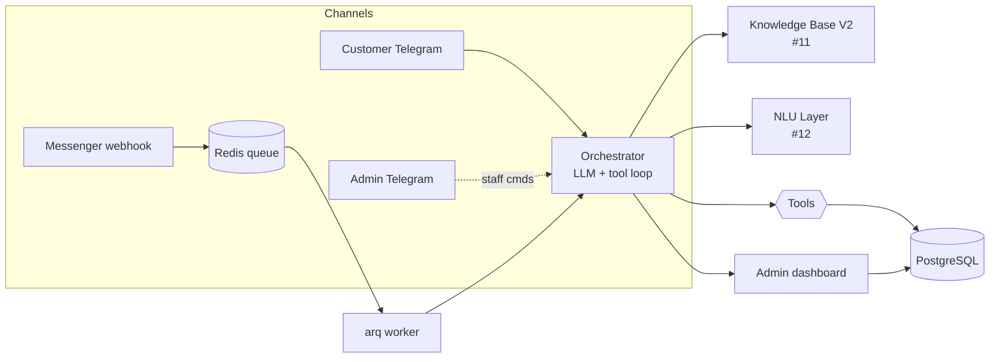

# Alpha3S Current Operation — Report for the design team (review of the sales + follow-up flow)

> **Date:** 2026-07-24 · **Author:** Claude Code (at Hoài's request)
> **Purpose:** Describe **how the system actually operates today** (as-built) so the design team can
> **review and redesign** a **unified, tight** sales + customer-care/follow-up process.
> This is NOT a fix proposal — it presents the current state + the gaps observed.
> Vietnamese version: `docs/SALES-FLOW-CURRENT-STATE-VI.md`.

---

## 1. Why this report exists

During live testing on Messenger, two symptoms revealed that the system **lacks a complete sales +
follow-up tool layer**:

1. **The bot "fabricated" an order** — the customer placed a 2nd order (12 jars), the bot said *"created
   successfully, Order #3"* but **never called the `create_order` tool** → no order in the DB. (A guard
   has been added as a stopgap — see §7 — but this signals a design problem, not just a bug.)
2. **The bot cannot look up an order** — when the customer asked *"where is order #3"*, the system **has
   no order-lookup tool** → it was forced to escalate to a human.

Hoài's assessment: the process should be **redesigned coherently** rather than patched piecemeal. This
report serves that.

---

## 2. Current architecture & processing flow

- **Messenger**: `POST /webhook` only validates + enqueues to Redis; the `arq` worker processes
  asynchronously → `orchestrator.handle_message()`.
- **Telegram (customer + admin)**: the listener calls `orchestrator.handle_message()` directly (no queue).
- **Orchestrator**: injects the system prompt + KB V2 hints + NLU hints, runs a **tool-calling loop**
  with the LLM (max 4 rounds), executes real tools, then returns one message to the customer.
  Conversation history lives in Redis (10 turns) + is logged to Postgres.
- **Dashboard**: staff view conversations and orders, pause/resume the bot, update order status manually.

---

## 3. The LLM's current toolset — ONLY 4 tools

| Tool | Function | Current limit |
|---|---|---|
| `search_products` | Look up product name/price/tiers | Read-only |
| `check_stock` | Check stock for a sku + quantity | Read-only |
| `create_order` | **Create a real order** (name, phone, address, sku, qty) → writes `orders`+`order_items`, decrements stock, status=`new` | Auto-confirms up to 100 jars (above that a staff price approval via `price_overrides` is required) |
| `escalate_to_human` | Hand the conversation to staff (pause bot + notify admin Telegram) | The catch-all for anything the bot can't do |

**No tool exists for:** order lookup/status, edit/cancel an order, update shipping info, track a
shipment, post-sale care, reminders/nudges, or proactive (outbound) messages.

---

## 4. Current order lifecycle — a gap between bot and dashboard

A state machine already exists in code (`orders.py`): **`new → confirmed → shipped → done`** (+
`cancelled` from any state except `done`).

**But** this state machine is **used only by staff via the dashboard**. On the **bot/customer** side:
- The bot **can only create `new` orders**, then is entirely **blind** to later steps.
- The bot **doesn't know** whether an order is `confirmed`/`shipped`/`done` → cannot answer status.
- There is no real shipping data → `create_order` deliberately tells the bot **not to state a specific
  delivery time** ("a team will confirm later").

→ Result: every post-purchase question ("is it confirmed", "when will it ship", "where is my order")
falls into escalation.

---

## 5. Current handoff / escalation

- `escalate_to_human`: sets `bot_paused=TRUE` on the conversation, records `escalations`, sends a message
  to the admin Telegram group (with a short customer code so staff can act quickly).
- Staff press "Resume" (Telegram button) or reply from the dashboard.
- This is the **only safety valve** for anything outside the 4 tools: order status, orders >100 jars,
  complaints, questions with no data, customers demanding a human.

---

## 6. GAPS & RISKS observed (the core section for the redesign)

| # | Gap | Real-world consequence |
|---|---|---|
| G1 | **No order-lookup tool** (status/tracking) | Customer asks "where's my order" → escalate; no self-service |
| G2 | **No follow-up / outbound** | No order re-confirmation, no shipping updates, no reminders, no re-engagement. The system is purely **reactive** |
| G3 | **Order confirmation is LLM-composed** | The confirmation text + "Order #N" is written by the model → **fabrication risk** (already happened). The source of truth (tool result) and the customer-facing message are **not tightly bound** |
| G4 | **Order lifecycle not exposed to the bot** | `confirmed/shipped/done` live only in the dashboard; the bot can't read/update them |
| G5 | **No shipping data** | No ETA/tracking/carrier → cannot answer delivery questions |
| G6 | **"Ghost" orders cause downstream confusion** | The fabricated order #3 made the customer believe it exists; with no lookup tool, staff must untangle it manually |
| G7 | **Multiple orders in one conversation** | No clear model — exactly where the fabrication bug originated |
| G8 | **Escalation is a catch-all** | Many "missing capability" cases funnel to humans; fine short-term, not scalable |
| G9 | **Per-channel customer identity** | `psid` (Messenger) / `tg:<id>` (Telegram) are separate; no unified cross-channel customer profile (important for the Phase II Gateway) |

---

## 7. Stopgaps already applied (to keep the system safe while awaiting the redesign)

- **Prompt**: a hard rule forbidding claiming "order created / Order #" without a successful
  `create_order`; each order must re-call the tool; with a real failure example.
- **Code guard** (`orchestrator.py`): if the reply says "order #/order created" but no `create_order`
  succeeded that turn → auto-escalate for real + return a safe message (never let the customer believe
  they bought). Unit-tested.
- **New-order notification** to the admin Telegram (`notify_admin_new_order`) when `create_order` succeeds.

> These are **risk mitigation**, NOT a substitute for redesigning the process. The guard may
> occasionally block rare legitimate cases (a customer referencing an old order) → itself a reason to
> have a clear order model.

---

## 8. Questions / decisions for the design team

1. **Which sales tools to add?** — `get_order`/`track_order` (look up by customer), `update_order`
   (edit address/qty before shipping), `cancel_order`. Should the `confirmed/shipped/done` lifecycle be
   exposed for the bot to read?
2. **Binding the order confirmation** — should the bot keep composing the confirmation, or should the
   system **generate the confirmation from the tool result itself** (a template with the real
   `order_id`) to eliminate fabrication at the root?
3. **Follow-up/outbound** — what model for: automatic order confirmation, shipping updates,
   payment/delivery reminders, post-sale care? This needs an outbound queue/scheduler + Meta's 24h policy.
4. **Shipping** — integrate a carrier / manual status + ETA so the bot can answer delivery questions?
5. **Unified customer identity** — a cross-channel customer profile (Messenger/Telegram/Web/Zalo) for
   the **Customer Terminal / Alpha3S Gateway** (Phase II).
6. **Bot vs human boundary** — which tasks the bot does itself (with tools), which require a human?
   Reduce dependence on the catch-all escalation.

---

## 9. Relation to Phase II (Alpha3S Gateway)

Many of these gaps (cross-channel identity, outbound/follow-up, action binding) **overlap** with the
"Customer Terminal / Gateway" architecture being designed (`AGW-ROADMAP-001`). Suggestion: the design
team review this report **together with** the Phase I completion report
(`docs/PHASE1-COMPLETION-REPORT-EN.md`) to decide whether the "sales + follow-up process" belongs in the
current App or should be reshaped in the Gateway.

---

## 10. Reference documents

- `docs/PHASE1-COMPLETION-REPORT-{VI,EN}.md` — Phase I summary.
- `docs/BACKEND_API-VI.md` — tool/service/worker details.
- `app/prompts/system_prompt.md` — bot behavior rules (including order-taking + safety).
- `app/services/tools.py`, `app/services/orchestrator.py`, `app/services/orders.py` — relevant source.
- `ISSUES-VI.md` — backlog #1–#12.
