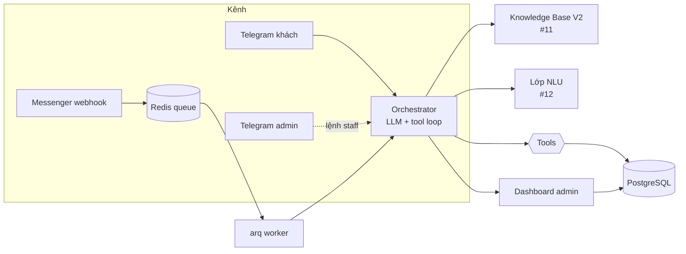

# Hiện trạng vận hành Alpha3S — Báo cáo cho team thiết kế (review quy trình bán hàng + follow-up)

> **Ngày:** 24/07/2026 · **Người soạn:** Claude Code (theo yêu cầu anh Hoài)
> **Mục đích:** Mô tả **đúng cách hệ thống đang vận hành hiện tại** (as-built) để team thiết kế
> **review và thiết kế lại** một quy trình bán hàng + chăm sóc/follow-up **thống nhất, chặt chẽ**.
> Đây KHÔNG phải đề xuất fix — chỉ trình bày hiện trạng + khoảng trống quan sát được.
> Bản EN: `docs/SALES-FLOW-CURRENT-STATE-EN.md`.

---

## 1. Vì sao có báo cáo này

Trong lúc test thật trên Messenger, phát hiện 2 hiện tượng cho thấy hệ thống **thiếu một lớp
tool bán hàng + follow-up hoàn chỉnh**:

1. **Bot từng "bịa" đơn** — khách đặt đơn thứ 2 (12 hũ), bot báo *"đã tạo thành công, Mã đơn #3"*
   nhưng **không hề gọi tool `create_order`** → DB không có đơn. (Đã thêm guard chặn tạm — xem §7 —
   nhưng đây là dấu hiệu của vấn đề thiết kế, không chỉ là bug.)
2. **Bot không tra cứu được đơn** — khi khách hỏi *"đơn #3 tới đâu rồi"*, hệ thống **không có tool
   tra cứu trạng thái đơn** → buộc phải escalate cho nhân viên.

Anh Hoài nhận định: cần **thiết kế lại quy trình cho thống nhất** thay vì vá lẻ. Báo cáo này phục vụ
việc đó.

---

## 2. Kiến trúc & luồng xử lý hiện tại

- **Messenger**: webhook `POST /webhook` chỉ validate + đẩy vào Redis, worker (`arq`) xử lý bất
  đồng bộ → `orchestrator.handle_message()`.
- **Telegram (khách + admin)**: listener gọi thẳng `orchestrator.handle_message()` (không qua queue).
- **Orchestrator**: bơm system prompt + gợi ý KB V2 + hint NLU, chạy **vòng lặp tool-calling** với
  LLM (tối đa 4 vòng), thực thi tool thật, rồi trả 1 câu cho khách. Lịch sử hội thoại giữ trong Redis
  (10 lượt) + log vào Postgres.
- **Dashboard**: nhân viên xem hội thoại, đơn, pause/resume bot, cập nhật trạng thái đơn thủ công.

---

## 3. Bộ công cụ (tool) LLM đang có — CHỈ 4 tool

| Tool | Chức năng | Giới hạn hiện tại |
|---|---|---|
| `search_products` | Tra tên/giá/bậc giá sản phẩm | Chỉ đọc |
| `check_stock` | Kiểm tra tồn kho cho sku + số lượng | Chỉ đọc |
| `create_order` | **Tạo đơn thật** (tên, SĐT, địa chỉ, sku, số lượng) → ghi `orders`+`order_items`, trừ kho, status=`new` | Tự chốt tối đa 100 hũ (trên đó phải staff duyệt giá qua `price_overrides`) |
| `escalate_to_human` | Chuyển hội thoại cho nhân viên (pause bot + báo Telegram admin) | Là "catch-all" cho mọi việc bot không làm được |

**Không có tool cho:** tra cứu/trạng thái đơn, sửa/hủy đơn, cập nhật thông tin giao hàng, tra vận
đơn, chăm sóc sau bán, nhắc/nudge, gửi tin chủ động (outbound).

---

## 4. Vòng đời đơn hàng hiện tại — lệch giữa bot và dashboard

State machine đã có trong code (`orders.py`): **`new → confirmed → shipped → done`** (+ `cancelled`
từ mọi trạng thái trừ `done`).

**Nhưng:** state machine này **chỉ nhân viên dùng qua dashboard**. Phía **bot/khách**:
- Bot **chỉ tạo được đơn `new`**, rồi **"mù"** hoàn toàn với các bước sau.
- Bot **không biết** đơn đã `confirmed`/`shipped`/`done` chưa → không trả lời được trạng thái.
- Không có dữ liệu vận chuyển thật → `create_order` cố tình dặn bot **không nêu thời gian giao cụ
  thể** ("sẽ có đội ngũ xác nhận sau").

→ Kết quả: mọi câu hỏi sau khi đặt hàng ("xác nhận chưa", "khi nào giao", "đơn tới đâu") đều rơi
vào escalate.

---

## 5. Handoff / Escalation hiện tại

- `escalate_to_human`: đặt `bot_paused=TRUE` cho hội thoại, ghi `escalations`, gửi Telegram nhóm
  admin (kèm mã số khách ngắn để staff thao tác nhanh).
- Nhân viên bấm "Resume" (nút Telegram) hoặc vào dashboard trả lời.
- Đây là **van an toàn duy nhất** cho mọi tình huống ngoài 4 tool: hỏi trạng thái đơn, đơn >100 hũ,
  khiếu nại, câu hỏi không có dữ liệu, khách đòi gặp người.

---

## 6. KHOẢNG TRỐNG & RỦI RO quan sát được (phần chính cho thiết kế lại)

| # | Khoảng trống | Hệ quả thực tế |
|---|---|---|
| G1 | **Thiếu tool tra cứu đơn** (status/tracking) | Khách hỏi "đơn tới đâu" → escalate; không tự phục vụ được |
| G2 | **Không có follow-up / outbound** | Không xác nhận lại đơn, không báo giao hàng, không nhắc, không re-engage. Hệ thống thuần **phản ứng**, không chủ động |
| G3 | **Xác nhận đơn do LLM tự soạn** | Câu chốt đơn + "Mã đơn #N" do model tự viết → **rủi ro bịa** (đã xảy ra). Nguồn sự thật (kết quả tool) và tin nhắn gửi khách **không ràng buộc chặt** |
| G4 | **Lifecycle đơn không lộ cho bot** | `confirmed/shipped/done` chỉ ở dashboard; bot không đọc/không cập nhật được |
| G5 | **Thiếu dữ liệu vận chuyển** | Không ETA/tracking/đơn vị vận chuyển → không trả lời giao hàng |
| G6 | **Đơn "ma" gây nhiễu về sau** | Đơn #3 bịa khiến khách tin là có; không có tool tra cứu → nhân viên phải gỡ rối thủ công |
| G7 | **Nhiều đơn trong 1 hội thoại** | Chưa có mô hình rõ ràng — chính chỗ phát sinh lỗi bịa đơn |
| G8 | **Escalation là catch-all** | Nhiều "thiếu năng lực" dồn về người thật; ổn ngắn hạn, không mở rộng được |
| G9 | **Danh tính khách theo từng kênh** | `psid` (Messenger) / `tg:<id>` (Telegram) riêng lẻ; chưa có hồ sơ khách hợp nhất đa kênh (quan trọng cho Gateway Giai đoạn II) |

---

## 7. Biện pháp tạm thời đã áp (để hệ thống an toàn trong lúc chờ thiết kế lại)

- **Prompt**: luật cứng cấm báo "đã tạo đơn / Mã đơn #" khi chưa gọi `create_order` thành công;
  mỗi đơn phải gọi lại tool; kèm ví dụ thất bại thật.
- **Guard tầng code** (`orchestrator.py`): nếu reply nói "mã đơn/đã tạo đơn" mà lượt đó **không có
  `create_order` thành công** → tự escalate thật + trả lời an toàn (không để khách tưởng đã mua). Có
  test đơn vị.
- **Thông báo đơn mới** cho admin Telegram (`notify_admin_new_order`) khi `create_order` thành công.

> Đây là **giảm thiểu rủi ro**, KHÔNG thay cho việc thiết kế lại quy trình. Guard có thể chặn nhầm
> vài trường hợp hiếm (khách nhắc đơn cũ) → đó cũng là lý do cần một mô hình đơn hàng rõ ràng.

---

## 8. Câu hỏi / quyết định gợi mở cho team thiết kế

1. **Tool bán hàng cần thêm?** — `get_order`/`track_order` (tra cứu theo khách), `update_order`
   (sửa địa chỉ/số lượng trước khi giao), `cancel_order`. Có expose lifecycle `confirmed/shipped/done`
   cho bot đọc không?
2. **Ràng buộc xác nhận đơn** — nên để bot tự soạn câu chốt, hay hệ thống **tạo câu xác nhận từ
   chính kết quả tool** (template có `order_id` thật) để loại bỏ tận gốc rủi ro bịa?
3. **Follow-up/outbound** — mô hình nào cho: xác nhận đơn tự động, cập nhật giao hàng, nhắc thanh
   toán/nhận hàng, chăm sóc sau bán? Cần lớp lịch/hàng đợi outbound + chính sách Meta 24h.
4. **Vận chuyển** — tích hợp đơn vị vận chuyển / nhập tay trạng thái + ETA để bot trả lời được?
5. **Danh tính khách hợp nhất** — hồ sơ khách xuyên kênh (Messenger/Telegram/Web/Zalo) cho kiến
   trúc **Customer Terminal / Alpha3S Gateway** (Giai đoạn II).
6. **Ranh giới bot vs người** — việc nào bot tự làm (có tool), việc nào bắt buộc người? Giảm phụ
   thuộc escalate catch-all.

---

## 9. Liên hệ với Giai đoạn II (Alpha3S Gateway)

Nhiều khoảng trống trên (danh tính đa kênh, outbound/follow-up, ràng buộc hành động) **trùng phạm vi**
với kiến trúc "Customer Terminal / Gateway" đang được thiết kế (`AGW-ROADMAP-001`). Đề xuất: team thiết
kế xem báo cáo này **cùng** báo cáo hoàn thành Giai đoạn I (`docs/PHASE1-COMPLETION-REPORT-VI.md`) để
quyết định phần "quy trình bán hàng + follow-up" nên nằm ở App hiện tại hay được định hình lại trong
Gateway.

---

## 10. Tài liệu tham chiếu

- `docs/PHASE1-COMPLETION-REPORT-{VI,EN}.md` — tổng kết Giai đoạn I.
- `docs/BACKEND_API-VI.md` — chi tiết tool/service/worker.
- `app/prompts/system_prompt.md` — luật hành vi bot (bao gồm chốt đơn + an toàn).
- `app/services/tools.py`, `app/services/orchestrator.py`, `app/services/orders.py` — mã nguồn liên quan.
- `ISSUES-VI.md` — backlog #1–#12.
